# GM2 — Refugio de animales

**Equipo**

- Alejandro Estepa Gallego
- Darío Acosta Sánchez
- Juan García Sanchez
- Fran López Trapero

Práctica 1 de Programación Web (curso 2026/2027, Universidad de Córdoba).

Aplicación web para gestionar un refugio de animales en adopción. La usan los
trabajadores del centro para registrar los animales rescatados y sus cuidados,
tramitar adopciones y organizar las visitas de grupos escolares.

## Funcionalidad

| Bloque | Qué cubre |
| --- | --- |
| A. Trabajadores | Alta de administrativos, monitores y veterinarios; disponibilidad semanal de los monitores; listados por categoría y por día. |
| B. Animales | Registro de llegada y asignación de recinto; historial clínico e ingresos en el hospital; listados por recinto, en hospital y por veterinario. |
| C. Adopciones | Registro de adoptantes y adopciones; notificación de fallecimiento; listados por año, tipo de animal y persona. |
| D. Visitas escolares | Alta de centros educativos; solicitudes de visita; asignación de monitor y día; finalización de la visita. |

## Tecnologías

Java 17 y Spring Boot 3.5.3 (Spring Web y Thymeleaf), con Maven. La base de
datos es MySQL 8.0.16+ o MariaDB 10.4+; el acceso por JDBC se añadirá al
`pom.xml` cuando se implementen los repositorios.

## Organización: Modelo-Vista-Controlador

El proyecto sigue la misma estructura que los ejemplos de la asignatura.

| Capa | Dónde está | Qué contiene |
| --- | --- | --- |
| Modelo | `model/domain/` | Clases de dominio que reflejan las tablas |
| Modelo | `model/repository/` | Acceso a la base de datos con JDBC |
| Controlador | `controller/` | Reciben la petición, usan el modelo y eligen la vista |
| Vista | `resources/templates/` | Plantillas HTML con Thymeleaf |
| Vista | `resources/static/` | CSS e imágenes |

```
pom.xml                                Dependencias y configuración de Maven
mvnw, mvnw.cmd, .mvn/                  Maven Wrapper
src/main/java/es/uco/pw/refugio/
    RefugioApplication.java            Clase principal
    controller/                        Controladores
    model/domain/                      Clases de dominio
    model/domain/enums/                Enumerados; coinciden con los ENUM de la BD
    model/repository/                  Repositorios (pendiente)
src/main/resources/
    application.properties             Configuración de la aplicación
    db/schema.sql                      Tablas, claves y restricciones CHECK
    db/datos_iniciales.sql             Recintos precargados
    static/css/                        Hojas de estilo
    templates/                         Vistas
src/test/java/es/uco/pw/refugio/       Pruebas
docs/modelo_datos.svg                  Diagrama del esquema
refugio_er_mermaid.txt                 Fuente Mermaid del diagrama
```

## Estado actual

| Parte | Estado |
| --- | --- |
| Estructura del proyecto Spring | Hecha |
| Esquema relacional y datos iniciales | Hecho |
| Clases de dominio | Hechas, documentadas con Javadoc |
| Página de inicio (`HomeController` y `home.html`) | Hecha |
| Repositorios (JDBC) | Pendiente |
| Controladores y vistas de cada bloque | Pendiente |

## Cómo ejecutar

```sh
./mvnw test              # compila y pasa las pruebas
./mvnw spring-boot:run   # arranca en http://localhost:8080
```

En VS Code también se puede lanzar desde `RefugioApplication.java` con **Run**.

## Modelo de datos



El diagrama refleja `schema.sql` y se genera a partir de
`refugio_er_mermaid.txt`. Línea continua: relación identificadora (la
clave primaria del hijo incluye la del padre). Línea discontinua: clave ajena
normal.

### Decisiones de diseño

- **Trabajadores en una sola tabla** con `categoria` como discriminador
  (explicado más abajo).
- **Días de la semana como tablas aparte** (`disponibilidad_monitor`,
  `solicitud_dia_preferido`), porque son atributos multivaluados.
- **El hospital no es un recinto.** Un animal está en el hospital si tiene un
  ingreso con `fecha_salida` a `NULL`; en ese caso `id_recinto` es `NULL`. Un
  `CHECK` impide que un animal que requiere atención esté en un recinto.
- **La capacidad actual de un recinto no se almacena**: se calcula contando sus
  animales.
- **Un historial clínico por animal** (`codigo_animal` único), con un único
  veterinario aunque haya varios ingresos.
- **Un animal se adopta una sola vez** (`adopcion.codigo_animal` único), porque
  no hay devoluciones.
- **Los literales de los `ENUM` coinciden con los enumerados Java**, para
  convertirlos con `Enum.valueOf`.

### Por qué los trabajadores van en una sola tabla

En Java hay una jerarquía de clases (`Persona` → `Trabajador` →
`Administrativo`, `Monitor`, `Veterinario`), pero SQL no tiene herencia y hay que
traducirla. Se ha elegido la tabla única (*single table inheritance*): todos los
trabajadores se guardan en `trabajador` y la columna `categoria` indica la
subclase. `Trabajador.getCategoria()` hace de puente: al guardar da el valor de
esa columna y al leer decide qué clase se instancia.

Las dos partes no coinciden una a una porque cada lado se organiza como le
conviene. En Java una subclase no cuesta nada y da tipos distintos (un método
puede exigir un `Veterinario` y rechazar un `Monitor`); en SQL cada tabla
añadida supone un `JOIN` al leer y un `INSERT` más al dar de alta.

| Clase Java | Tabla | `categoria` |
| --- | --- | --- |
| `Administrativo` | `trabajador` | `ADMINISTRATIVO` |
| `Monitor` | `trabajador` | `MONITOR` |
| `Veterinario` | `trabajador` | `VETERINARIO` |
| `Trabajador`, `Persona` | Ninguna propia: son abstractas y solo agrupan campos comunes | |

Así quedan las filas:

| id | nombre | categoria | num_colegiado |
| --- | --- | --- | --- |
| 1 | Ana | `ADMINISTRATIVO` | `NULL` |
| 2 | Luis | `MONITOR` | `NULL` |
| 3 | Marta | `VETERINARIO` | COL-4521 |

Fuera de los trabajadores, cada clase corresponde a una tabla (`Animal` y
`animal`, `Recinto` y `recinto`...). Las tablas `disponibilidad_monitor` y
`solicitud_dia_preferido` no tienen clase: son el `Set<DiaSemana>` de `Monitor`
y de `SolicitudVisita`. En total, 13 clases para 11 tablas.

Motivos:

- **Solo hay un atributo propio de una subclase**, `num_colegiado`, así que la
  tabla tiene una única columna que admite `NULL`. Los días del monitor no son
  columnas: van en `disponibilidad_monitor`.
- **Los listados salen directos.** Listar trabajadores y filtrarlos por
  categoría es un `SELECT` sin joins.
- **El acceso a datos es más simple.** Dar de alta o leer un trabajador toca una
  sola tabla.

Costes que se asumen:

- `num_colegiado` queda a `NULL` en administrativos y monitores. Un `CHECK`
  obliga a que exista si la categoría es `VETERINARIO` y a que sea `NULL` en
  otro caso.
- Las claves ajenas a `trabajador` no distinguen la categoría, así que esa
  comprobación la hace la aplicación (ver la lista siguiente).

La alternativa descartada es una tabla por subclase (`administrativo`, `monitor`
y `veterinario` con clave ajena a `trabajador`). Garantiza la categoría desde la
base de datos, a cambio de joins en los listados y de escribir en dos tablas en
cada alta.

### Reglas que valida la aplicación, no el esquema

- Trabajadores y adoptantes mayores de edad.
- Las claves ajenas a `trabajador` no comprueban la categoría: que quien atiende
  sea veterinario, quien tramita sea administrativo y quien guía sea monitor.
- Solo se adoptan animales en estado `SANO`, y como máximo 5 adopciones activas
  por persona.
- Cada solicitud de visita tiene al menos un día preferido.
- Un monitor no tiene dos visitas sin finalizar el mismo día de la semana.
- No se asigna un monitor a un día ya cubierto mientras queden días laborables
  sin monitor.

## Base de datos

El nombre `refugio` es un ejemplo; usad el de vuestra instalación.

```sh
mysql -u USUARIO -p -e "CREATE DATABASE refugio CHARACTER SET utf8mb4"
mysql -u USUARIO -p refugio < src/main/resources/db/schema.sql
mysql -u USUARIO -p refugio < src/main/resources/db/datos_iniciales.sql
```

Los scripts no se ejecutan solos al arrancar la aplicación. `schema.sql` borra
las tablas antes de crearlas, así que volver a ejecutarlo elimina los datos.
